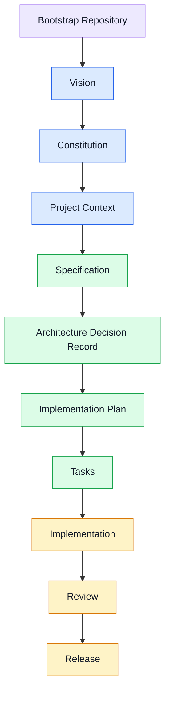

# DARP CLI

> **Developer AI Resource Platform**

DARP CLI is a developer-first command-line interface for discovering, installing, managing, versioning and evaluating AI assets.

The project is inspired by package managers such as npm, pip and cargo, but instead of managing software libraries, DARP manages reusable AI assets.

Examples of supported assets include:

- Prompts
- Instructions
- Skills
- Personas
- MCP Servers
- Workflows
- Templates
- Context Packages

## Vision

Build an open ecosystem for AI engineering where reusable assets can be versioned, shared and installed as easily as software packages.

## Getting Started

Before contributing to this project, read:

1. AGENTS.md
2. docs/PROJECT_CONTEXT.md
3. .spec/constitution.md

These documents define the project's vision, development methodology and architectural principles.

## DARP Development Lifecycle (DDL)

Every contribution to DARP follows the DARP Development Lifecycle (DDL), a Specification-Driven methodology designed for collaborative software engineering between humans and AI agents.

### Lifecycle Phases

| Phase | Purpose |
| --------- | ---------- |
| **Foundation** | Defines the identity and long-term direction of the project. |
| **Planning** | Describes what will be built and how it will be implemented. |
| **Execution** | Implements, validates and prepares the feature for release. |

## Principles

- Specification-Driven Development (SDD)
- AI-first development workflow
- Provider agnostic
- Reproducible
- Deterministic
- Extensible
- Open standards whenever possible

## Project Status

🚧 Early development

Current milestone:

- Repository foundation
- Development methodology
- Initial architecture
- Bootstrap repository structure

## Development Workflow

Every feature follows the same lifecycle:

Vision
→ Constitution
→ Specification
→ Plan
→ Tasks
→ Implementation
→ Review

No feature should be implemented before an approved specification exists.

## Repository Layout

The repository is bootstrapped for specification-driven development and intentionally contains no business implementation yet.

- `docs/`: project context, roadmap and lifecycle documentation
- `.spec/`: constitution, reusable templates and archival planning artifacts
- `cmd/`, `internal/`, `pkg/`, `test/`: reserved implementation areas for future approved work
- `assets/`: AI-oriented repository assets for tools such as Copilot and Codex
- `.github/`: prompts, agent guidance and workflow skeletons

## Supported AI Providers (planned)

- OpenAI
- Anthropic
- Google Gemini
- OpenRouter
- DeepSeek

## License

Apache 2.0 (planned)
