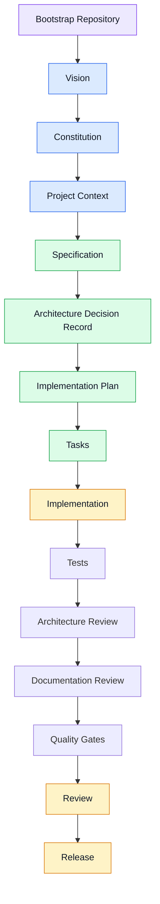

# DARP CLI

> **Developer AI Resource Platform**

DARP CLI is a developer-first command-line interface for discovering, installing, managing, versioning and evaluating AI assets.

The project is inspired by package managers such as npm, pip and cargo, but instead of managing software libraries, DARP manages reusable AI assets.

Examples of supported assets include:

- Prompts
- Instructions
- Skills
- Personas
- MCP Servers
- Workflows
- Templates
- Context Packages

## Vision

Build an open ecosystem for AI engineering where reusable assets can be versioned, shared and installed as easily as software packages.

## Getting Started

Before contributing to this project, read:

1. AGENTS.md
2. docs/PROJECT_CONTEXT.md
3. .spec/constitution.md
4. [CONTRIBUTING.md](CONTRIBUTING.md)
5. [CODE_OF_CONDUCT.md](CODE_OF_CONDUCT.md)

These documents define the project's vision, development methodology and architectural principles.

## Contributing

Contributions should follow the project's Specification-Driven Development
workflow and remain small, deterministic and reviewable. Read
[CONTRIBUTING.md](CONTRIBUTING.md) for local setup, validation commands,
issue and pull request guidance. Pull requests use the template in
[.github/pull_request_template.md](.github/pull_request_template.md).

All participants are expected to follow the [Code of Conduct](CODE_OF_CONDUCT.md).

## Current Command

The current implemented commands are:

```bash
darp init
darp doctor
darp --help
darp --version
```

This command initializes the current directory as a DARP project by creating `darp.yml`, the base `.darp/` contract structure, and the shared agent skills structure under `.agents/skills/`.
If a project is partial, it restores only missing DARP files and directories;
existing files, including files under `.spec/specs/`, are never overwritten.

`darp --help` shows the CLI description and useful commands.

`darp --version` shows the CLI version embedded at build time.

`darp doctor` performs a read-only diagnosis of the DARP project in the current
directory. It validates configuration, structure, workflows, skills, templates,
governance, and contract-version compatibility. It exits with code `1` when a
critical check fails; warnings still exit with code `0`. Each check is rendered
with its explicit `PASS`, `WARNING`, or `FAIL` state.

## Local Development

Build the binary for the current platform:

```bash
make build
```

Install the CLI into `~/.local/bin`:

```bash
make install
```

Check the computed version string:

```bash
make version
```

Run the configured static analysis:

```bash
make lint
```

The repository uses `golangci-lint` v2. If it is unavailable, the command
falls back to `go vet`. Lint caches are stored in the ignored `.cache/`
directory of the repository.

The `Makefile` computes the version automatically from Git:

- if `HEAD` is tagged with a SemVer tag like `v0.1.0`, the CLI version becomes `0.1.0`
- otherwise it falls back to a development version like `0.1.0-dev+115ee40`
- if the worktree is dirty, the suffix becomes `0.1.0-dev+115ee40.dirty`

## DARP Development Lifecycle (DDL)

Every contribution to DARP follows the DARP Development Lifecycle (DDL), a Specification-Driven methodology designed for collaborative software engineering between humans and AI agents.


```mermaid
flowchart TD

    B["Bootstrap Repository"]

    V["Vision"]
    C["Constitution"]
    PC["Project Context"]

    S["Specification"]
    ADR["Architecture Decision Record"]
    P["Implementation Plan"]
    T["Tasks"]

    I["Implementation"]
    TST["Tests"]
    AR["Architecture Review"]
    DR["Documentation Review"]
    QG["Quality Gates"]
    R["Review"]
    REL["Release"]

    B --> V
    V --> C
    C --> PC
    PC --> S
    S --> ADR
    ADR --> P
    P --> T
    T --> I
    I --> TST
    TST --> AR
    AR --> DR
    DR --> QG
    QG --> R
    R --> REL

    classDef bootstrap fill:#ede9fe,stroke:#7c3aed,color:#111827;
    classDef foundation fill:#dbeafe,stroke:#2563eb,color:#111827;
    classDef planning fill:#dcfce7,stroke:#16a34a,color:#111827;
    classDef execution fill:#fef3c7,stroke:#d97706,color:#111827;

    class B bootstrap;
    class V,C,PC foundation;
    class S,ADR,P,T planning;
    class I,R,REL execution;
```

### Lifecycle Phases

| Phase | Purpose |
| --------- | ---------- |
| **Foundation** | Defines the identity and long-term direction of the project. |
| **Planning** | Describes what will be built and how it will be implemented. |
| **Execution** | Implements, validates and prepares the feature for release. |

## Principles

- Specification-Driven Development (SDD)
- AI-first development workflow
- Provider agnostic
- Reproducible
- Deterministic
- Extensible
- Open standards whenever possible

## Project Status

🚧 Early development

Current milestone:

- Repository foundation
- Development methodology
- Initial architecture
- CLI features: `darp init` and `darp doctor`

## Development Workflow

Every feature follows the same lifecycle:

Vision
→ Constitution
→ Specification
→ Plan
→ Tasks
→ Implementation
→ Review

No feature should be implemented before an approved specification exists.

## Repository Layout

The repository now contains the first executable CLI baseline together with the existing specification-driven structure.

- `docs/`: project context, roadmap and lifecycle documentation
- `.spec/`: constitution and reusable planning templates
- `.spec/specs/`: feature bundles containing specification, plan and tasks
- `.darp/`: DARP project contracts, governance, workflows and templates
- `.agents/skills/`: project skills discovered by compatible coding agents
- `cmd/`, `internal/`, `pkg/`, `test/`: implementation areas for CLI and supporting packages
- `assets/`: AI-oriented repository assets for tools such as Copilot and Codex
- `.github/`: prompts, agent guidance and workflow skeletons

## Supported AI Providers (planned)

- OpenAI
- Anthropic
- Google Gemini
- OpenRouter
- DeepSeek

## License

Apache 2.0 (planned)
